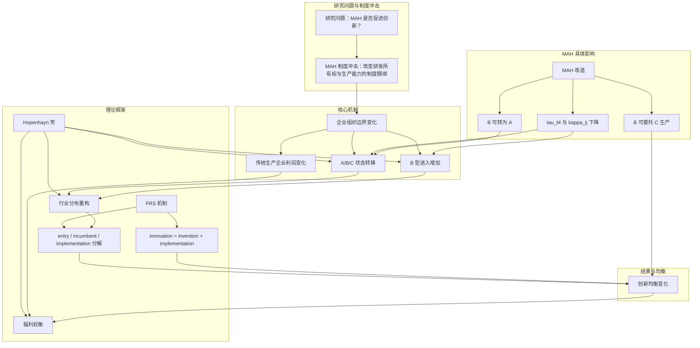

# MAH 制度与原研药创新：理论框架与实证策略

## 0. 发给合作者的超短版

### 0.1 微信短版

可以直接发这段：

> 我们现在对新结构经济学的处理，不是单独再建一个“大模型”，而是把它弱整合进原来的 `MAH` 模型里。具体做法是：保留原来的 `Hopenhayn + invention/implementation + A/B/C` 框架，再加入一个发展阶段参数 `\xi` 和一个制度适配函数 `\Lambda(z,\xi)`。这样，`MAH` 对商业化摩擦和组织重构门槛的影响就会随发展阶段和企业能力变化。它的好处是，既能体现“有为政府 + 有效市场”和“适宜制度安排”这些新结构思想，又不会和我们当前把 `MAH` 当政策冲击来做实证识别发生冲突。

### 0.2 邮件短版

如果想写得稍微正式一点，可以直接用这段：

> 我们目前对新结构经济学的处理采取的是“弱整合版”，而不是把它单独扩展成一套完整的制度内生模型。保留的主框架仍然是异质企业行业动态模型：`A/B/C` 三类企业、`invention/implementation` 分离、进入退出、状态转移和委托生产市场。新结构经济学进入模型的方式主要有两步：第一，用发展阶段参数 `\xi` 表示产业从仿制导向走向原研导向的升级阶段；第二，用制度适配函数 `\Lambda(z,\xi)` 表示制度安排与企业能力结构的匹配程度。然后让 `MAH` 通过商业化摩擦 `\tau(z,\xi,M)` 和组织重构门槛 `\kappa_{sj}(z,\xi,M)` 进入模型。这样一来，模型不仅能解释 `MAH` 为什么促进企业分化与原研药创新，还能推出一个更重要的异质性命题：如果 `MAH` 真的是更适宜当前发展阶段的制度安排，那么它的作用应当在更高发展阶段、产业基础更强和能力更高的企业中更明显。这也是我们后面最适合在实证中去验证的部分。

## 一、理论贡献与模型框架

### 理论贡献
- 从组织重构角度解释 MAH 对原研药创新的影响
- 整合新结构经济学视角，分析制度与发展阶段的匹配性
- 提供一个既能处理行业动态又能区分 invention 和 implementation 的理论框架

### 模型框架
本文采用"Hopenhayn 式行业状态转移框架 + FRS 式 invention/implementation 区分 + 委托生产市场"的混合模型，具体借鉴如下：

1. **Hopenhayn 框架**：
   - 借鉴点：异质企业、进入/退出、稳态分布
   - 解决问题：刻画企业在 A/B/C 三种组织形式之间的状态转移和行业结构变化
   - 应用：企业类型转移矩阵、进入结构、退出行为

2. **FRS（Aghion et al.）框架**：
   - 借鉴点：invention vs implementation 分离
   - 解决问题：区分原研药研发投入与成果实现，解释 MAH 如何降低原研药商业化摩擦
   - 应用：B 型企业的原研药 idea 实现价值、implementation rate

3. **委托生产市场**：
   - 借鉴点：中间品市场均衡
   - 解决问题：连接 B 型（原研药研发）和 C 型（生产）企业，反映原研药外包需求变化
   - 应用：委托生产价格、市场清算条件

4. **新结构经济学扩展**：
   - 借鉴点：发展阶段参数、制度适配度
   - 解决问题：分析 MAH 效应在不同发展阶段和企业能力下的异质性
   - 应用：交互项实证检验、条件性福利结论

## 二、核心研究问题与结论

### 顶层问题
- **经验问题**：MAH 是否促进原研药创新？
- **机制问题**：MAH 是否主要通过降低原研药研发成果商业化的制度摩擦、诱导企业从一体化走向专业化，从而促进原研药创新？

### 核心结论
1. **主结论**：MAH 促进了原研药创新。
2. **机制结论**：这种作用并不一定只是"原研药研发更多了"，更可能与原研药研发型企业更容易实现创新成果有关。
3. **模型结论**：MAH 通过降低原研药研发所有权与生产能力捆绑的制度成本，改变企业组织形式选择、进入结构与状态转移，从而影响原研药创新均衡。

## 三、原研药创新的分解与机制

### 原研药创新的构成
观测到的原研药创新结果可分解为：
$$\text{Observed Innovation} = \text{Idea Generation} \times \text{Implementation / Commercialization} \times \text{Other Success Factors}$$

### 原研药创新上升的可能来源
- 企业原研药研发投入更多了
- 企业组织方式变了，已有原研药 idea 更容易实现了
- 新进入的企业更偏原研药研发型
- 原有企业更容易从生产型转成原研药研发/混合型
- 审批、注册、商业化预期更好了，企业更愿意申报原研药

### 数据能回答什么
- **最稳地能识别的是总效应**：$$MAH \rightarrow \text{原研药创新上升}$$
- **不能直接分离**：到底是原研药 idea generation 上升了，还是原研药 implementation probability 上升了

### 为什么可以讲 implementation 机制
- implementation 机制是理论机制，不是直接单独识别的经验对象
- 原研药创新数据间接包含了 implementation 激励：企业做原研药研发是因为预期成果能被实现并带来回报
- MAH 让原研药研发型企业觉得"可以自己持证、外包生产，不一定非要自己建厂"，从而更愿意研发、申请、推进原研药创新

### 严谨的表述方式
1. **MAH 提高了原研药研发型企业开展创新的预期回报。**
2. **MAH 降低了原研药研发成果转化为可商业化产品的制度摩擦。**
3. **MAH 提高了原研药研发专门化企业实现创新成果的预期商业化价值。**
4. **本文不直接识别 implementation probability 本身，而是识别 MAH 对原研药创新产出与企业组织重构的影响，并将其解释为与原研药商业化摩擦下降一致的机制。**

## 四、机制链条与融资渠道

### 四段机制链条
$$MAH \rightarrow \text{降低原研药商业化摩擦} \rightarrow \text{提高原研药研发项目预期回报} \rightarrow \begin{cases}\text{既有企业更愿意进行原研药创新/重组} \\\text{新原研药研发主体更愿意进入} \\\text{资本更愿意支持原研药研发型企业}\end{cases} \rightarrow \text{原研药创新均衡变化}$$

### 融资渠道的定位
- 融资改善不是与 implementation 机制对立的另一套故事，而是 implementation 机制向前传导到 entry / financing 的一条上游渠道
- 具体链条：MAH 降低原研药商业化摩擦 → 原研药创新项目预期回报上升 → 原研药创新实验室/biotech 更愿意进入 → VC/PE 更愿意投 → 原研药研发型进入增加 → 原研药创新增加

### 模型中的处理
- 放在 entry margin，作为 B 型进入的强化版
- 可 reduced-form 地写成：$$\int V_B(z_0;M)\, dG(z_0) \ge c_{EB}$$
- 融资约束可扩展为：$$\int V_B(z_0;M)\, dG(z_0) \ge c_{EB} - \phi(M)$$，其中 \(\phi(M)\) 表示外部融资支持

### 实证表述建议
- 有融资数据：可把"VC/风投更愿意支持原研药创新项目"写成可检验机制
- 无融资数据：可写成理论上合理的补充渠道，但不要写成被直接识别的主结论

## 五、新结构经济学的整合

### 整合层次
1. **可实施，建议保留**：\(\xi\) 作为发展阶段/产业基础参数；\(\Lambda(z,\xi)\) 作为制度适配度；\(\tau\)、\(\kappa\) 随 \(\xi\) 和 \(z\) 异质变化；推出"政策效应在更高发展阶段、更高能力企业上更强"的命题
2. **可写进理论，但不要作为主识别对象**："制度是否适宜发展阶段"；"净效应取决于制度供给和能力结构匹配"
3. **目前不建议作为正文主模型硬做**：政府显式解 \(\max_M W(M,\xi)\)；阈值 \(\xi^*\)；完整的"制度内生选择"结构

### 可实施的整合方式
- 原有壳不变：A/B/C、Bellman、进入退出、委托生产市场
- 新加外生参数：\(\xi\)（发展阶段）
- 新加适配函数：\(\Lambda(z,\xi)\)
- 让它进入：\(\tau(z,\xi,M)\)、\(\kappa_{sj}(z,\xi,M)\)

### 可识别的部分
- 将 \(\xi\) 理解为地区或企业可观测特征（如地区医药产业基础、创新基础、生物医药集聚度、高技术人力资本、企业初始研发能力）
- 做交互项：$$MAH \times \xi$$ 或 $$MAH \times \text{initial capability}$$
- 检验：发展阶段更高的地区，政策效应是否更强；初始能力更强的企业，政策效应是否更强

### 理论结果
- **能稳稳推出的结论**：
  1. MAH 降低 B 的商业化摩擦：$$\frac{\partial \Psi_B}{\partial M}>0$$
  2. MAH 降低组织重构门槛，提高状态转移概率：$$\frac{\partial P_{sj}}{\partial M}>0$$
  3. 发展阶段越高、能力越强，政策效应越强：$$\frac{\partial^2 \Psi_B}{\partial M\partial \xi}>0,\quad \frac{\partial^2 P_{sj}}{\partial M\partial \xi}>0$$
  4. 原研药创新增加来自进入、implementation 和组织重构
  5. 福利是净效应：创新正效应和传统生产利润负效应要比较大小

- **不适合硬推成强结论的部分**："MAH 一定是最优制度"；"净福利一定为正"；"存在精确阈值 \(\xi^*\) 并且能实证识别出来"

### 建议采用"二层结构"
- **第一层：正文主模型**：用基准版；A/B/C；invention vs implementation；进入退出；委托生产市场；福利权衡
- **第二层：新结构经济学扩展**：引入 \(\xi\)；引入 \(\Lambda(z,\xi)\)；推出异质性命题；解释"适宜制度安排"

## 六、模型框架与逻辑

### 模型选择的理由
- **为什么用 Hopenhayn 式异质企业行业均衡壳**：
  1. 天然适合处理企业异质性（A/B/C 三类企业，能力不同）
  2. 天然适合处理进入和退出（entry / exit / stationary distribution）
  3. 天然适合处理"行业结构变化"（A/B/C 占比变化、企业分化、组织边界重构）
  4. 能给一个"够用的 GE"，但不会过重
  5. 和实证最容易对上（转移矩阵、entry 结构、exit、各类企业占比变化）

- **为什么不是直接照 FRS 或 Klette-Kortum**：它们更擅长讲创新竞争、创造性毁灭、技术阶梯、startup acquisition，而本文核心是监管改变组织边界、企业在 A/B/C 之间重组、行业构成变化带来创新变化

### 核心逻辑
- **壳**：Hopenhayn（处理行业组织重构）
- **机制**：FRS 的 invention vs implementation（处理创新不能自动实现）

### 逻辑框架图

## 七、数据建议与证据链

### 优先获取的数据
1. **原研药研发支出 / 原研药研发人员 / 技术人员占比**：区分"原研药研发更多了"还是"转化效率更高了"
2. **企业类型转移矩阵数据**：看 A/B/C 的组织重构
3. **委托生产 / CMO / CDMO / 受托生产 / 持证相关文本证据**：看原研药 commercialization 方式是否变了
4. **原研药申请到获批 / 临床推进 / 上市推进指标**：更接近原研药 implementation

### 构建证据链
- MAH -> 企业组织形式变化
- MAH -> 原研药 commercialization 方式变化
- MAH -> 原研药创新结果变化

## 八、最终建议

### 论文结构
- **引言**：提出研究问题和机制假说
- **理论模型**：Hopenhayn 壳 + FRS 机制 + 新结构经济学扩展
- **实证分析**：识别 MAH 对原研药创新产出和企业组织结构的影响
- **机制检验**：通过组织重构、进入结构等间接验证 implementation 机制
- **异质性分析**：检验发展阶段和企业能力的调节效应
- **结论与政策建议**

### 关键表述
- **经验问题**：MAH 是否促进原研药创新？
- **机制假说**：MAH 通过降低原研药研发成果商业化的制度摩擦，提高原研药研发型企业的预期实现价值，并诱导企业从一体化走向专业化，从而促进原研药创新。
- **识别边界**：本文直接识别的是 MAH 对原研药创新产出和企业组织结构的影响；对"implementation"机制的识别主要是间接的、模型化的，而非对实施概率本身的直接估计。
