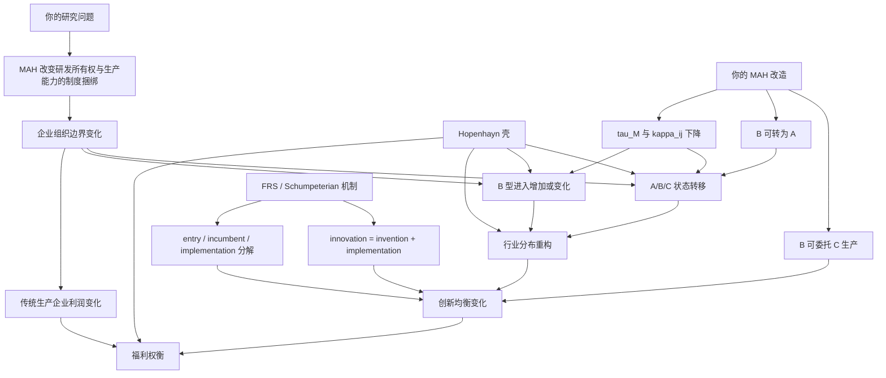
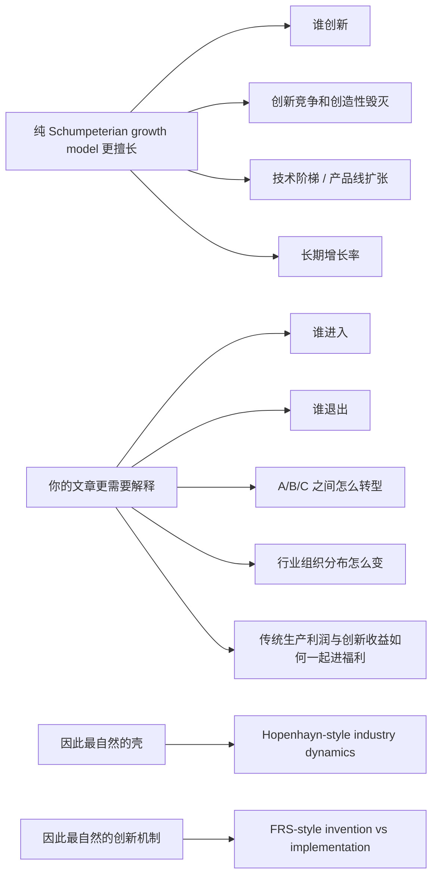

# 为什么这篇文章更适合用 `Hopenhayn` 壳，而不是直接用纯 Schumpeterian growth model

## 1. 一句话结论

最简洁的判断是：

> 你的文章要解释的核心对象是“企业进入、退出、组织状态转移和行业分布如何因制度冲击而变化”，因此更需要一个 `Hopenhayn` 式异质企业行业均衡壳；而 `FRS` 或更一般的 Schumpeterian growth model 更适合提供“innovation = invention + implementation”这一创新机制层。

因此，最合适的组合不是二选一，而是：

**`Hopenhayn` 壳 + `FRS` 机制 + `MAH` 场景改造。**

## 2. 结构图

## 3. 对照图：为什么不是直接上纯 Schumpeterian growth model

## 4. 最推荐的汇报口径

你以后可以直接这样讲：

> 如果只用纯 Schumpeterian growth model，它很适合讲创新竞争和增长，但不够贴合我这篇文章最关心的企业进入、退出和组织状态转移。我的问题本质上是一个行业组织重构问题，所以外层需要 `Hopenhayn` 式异质企业行业均衡壳；但同时，创新又不能只写成研发投入自动产出，因此我从 `FRS` 借了 invention 和 implementation 的区分。最终的模型不是单独照搬哪一篇，而是用 `Hopenhayn` 来承载 industry dynamics，用 `FRS` 来承载 innovation mechanism，再把 `MAH` 的制度含义写成研发-生产边界变化。 

## 5. 最短版结论

- `Hopenhayn` 回答：企业怎么进、怎么退、怎么分布、怎么重组。
- `FRS` 回答：创新为什么不能只看发明，还要看 implementation。
- `MAH` 模型回答：制度如何改变研发与生产是否必须在同一企业内完成。

三者合在一起，才是你这篇文章最合适的理论结构。
